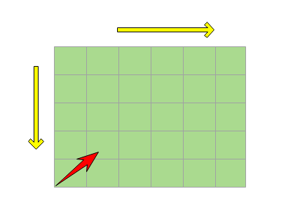

#### 解题思路 :

> **从左下角开始比较，使得比较的三种不同结果（>,<,==) 都能确认的进行下一次比较或者得出结果。**
#### OJ代码
```java 
import java.util.*;
public class Solution {
    public boolean Find(int target, int [][] array) {
        int hang=array.length;
        int lie=array[0].length;
        //判空
        if(lie==0){
            return false;
        }
        //判非区间
        if(target>array[hang-1][lie-1]||target<array[0][0]){
            return false;
        }
        for(int i=hang-1;i>=0;i--){
            for(int j=0;j<lie;j++){
                if(target==array[i][j]){
                    return true;
                }else{
                    //continue;
                }
            }
        }
        return false;
    }
}
```