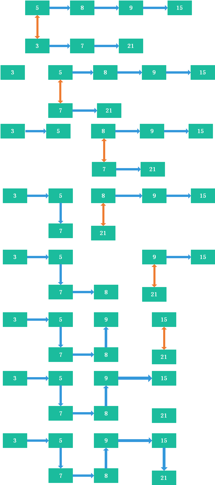

#### 解题思路：


> 每次比较当前节点信息，选出最小者，最小者即为两个现存链表中的最小者，加入到结果链表成为其下一节点。

#### OJ代码
```java 
// 递归方法
public ListNode Merge(ListNode list1,ListNode list2) {
       if(list1 == null)
           return list2;
       if(list2 == null)
           return list1;
       if(list1.val <= list2.val){
           list1.next = Merge(list1.next, list2);
           return list1;
       }else{
           list2.next = Merge(list1, list2.next);
           return list2;
       }       
   }
//非递归方法
public class Solution {
    public ListNode Merge(ListNode list1,ListNode list2) {
       ListNode result=new ListNode(-1);
       ListNode result_head=result;
       while(list1!=null&&list2!=null){
            if(list1.val<list2.val){
                result.next=list1;
                result=list1;
                list1=list1.next;
            }else{
                result.next=list2;
                result=list2;
                list2=list2.next;
            }
       }
        if(list1!=null)
            result.next=list1;
        if(list2!=null)
            result.next=list2;
        return result_head.next;
    } 
}
```
