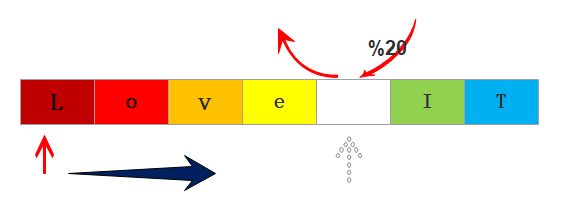

#### 解题思路：


> 归根结底，遍历替换。

#### OJ代码
```java 

public class Solution {
    //使用函数replace的方法
    public String replaceSpace(StringBuffer str) {
    	while(str.indexOf(" ")!=-1){
	            str.replace(str.indexOf(" "),
                 str.indexOf(" ")+1, "%20");
	        }
	        return str.toString();
    }
}
```

